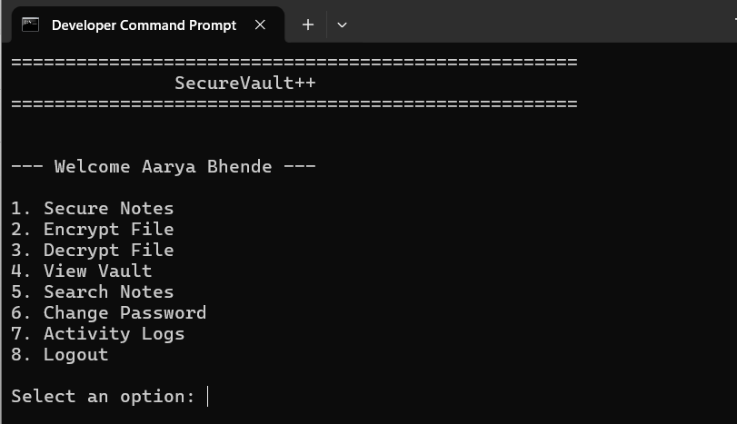
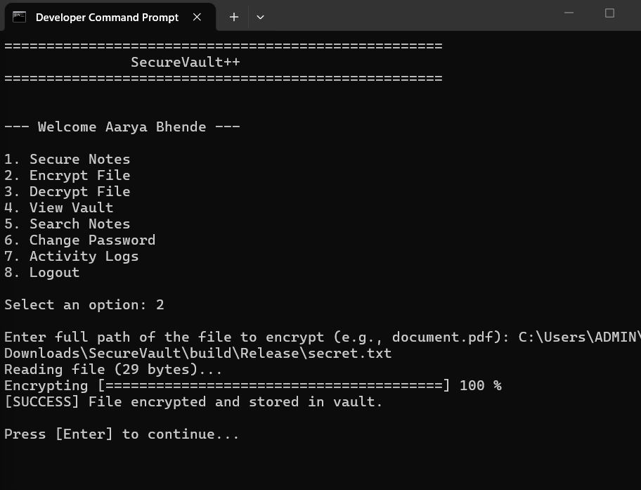
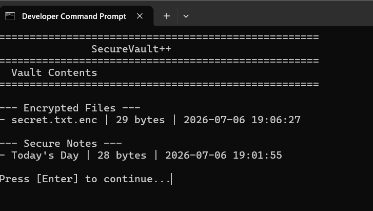
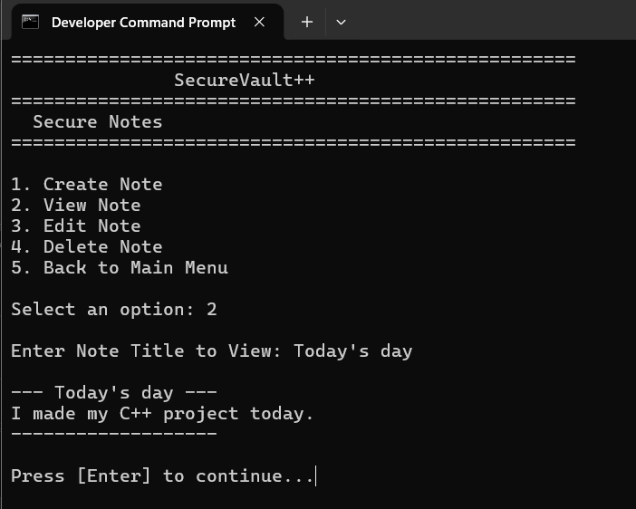

# SecureVault++ : Encrypted File & Notes Storage System

SecureVault++ is a professional, terminal-based cybersecurity application built entirely in modern C++17. It provides a secure, locally encrypted vault for users to store sensitive notes and external files (PDFs, Images, Archives) using a password-derived cryptographic key.

<div align="center">
  
</div>

<br>

This project was developed to demonstrate enterprise-level object-oriented design, raw binary memory management, and secure system architecture without relying on third-party libraries.

## 🚀 Key Features

* **Secure Authentication:** User registration and login system with password strength validation and brute-force lockout mechanisms.
* **Cryptographic Engine:** Custom encryption engine (V1: XOR) designed with the Open-Closed Principle to easily swap in AES-256 in future iterations.
* **Binary File I/O:** Safe, byte-level reading and writing of external files ensuring zero data corruption across formats (TXT, PDF, JPG, ZIP).
* **Secure Notes:** Full CRUD (Create, Read, Update, Delete) capabilities for encrypted text notes, complete with case-insensitive search functionality.
* **Auditable Logging:** Thread-safe, timestamped activity logs tracking system access and cryptographic operations.
* **Cross-Platform UI:** ANSI-escaped terminal interface with progress bars and masked secure password inputs (POSIX and Windows compatible).

---

## 📸 Application Showcase

### 🔒 File Encryption Engine
<div align="center">
  
</div>
<br>
<em>Real-time binary processing of external files into the secure vault environment without corrupting target file structures.</em>

### 🗄️ Vault Indexing & Management
<div align="center">
  
</div>
<br>
<em>Auditable, timestamped indexing of all secured notes and encrypted external files utilizing std::filesystem.</em>

### 📝 Secure Notes System
<div align="center">
  
</div>
<br>
<em>In-memory CRUD operations for sensitive text, immediately encrypted before persisting to the local disk.</em>

---

## 🧠 Technical Architecture

The application is heavily modularized to prevent circular dependencies and enforce the Single Responsibility Principle:

* **Language:** C++17
* **Memory Safety:** RAII, `std::unique_ptr` (implicit via STL), `std::vector<uint8_t>` for cryptographic buffers.
* **Standard Template Library (STL):** Extensive use of `<filesystem>`, `<fstream>`, `<chrono>`, and `<optional>`.
* **State Management:** Strict initialization parameters (e.g., the `Vault` cannot be instantiated without a verified `User` context).

### Folder Structure
```text
SecureVault/
├── assets/            # UI Screenshots for documentation
├── include/           # Header files (Interfaces)
├── src/               # Source files (Implementations)
├── users/             # Hashed credentials storage
├── vault/             # Encrypted user data
├── logs/              # Activity logs
└── CMakeLists.txt     # Build configuration
